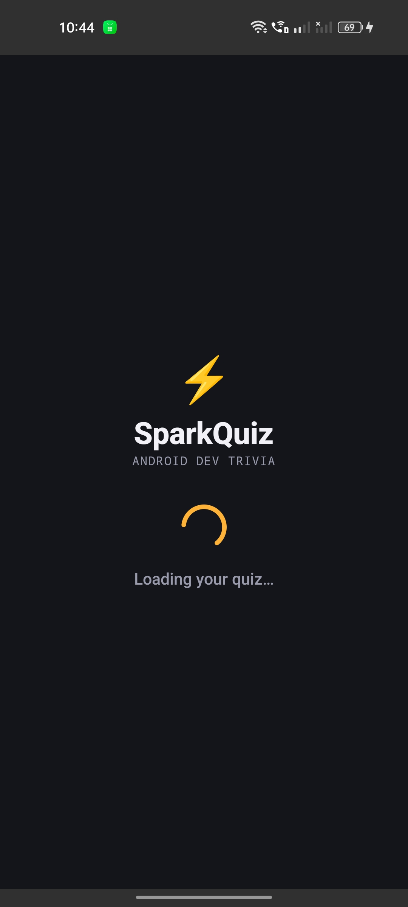
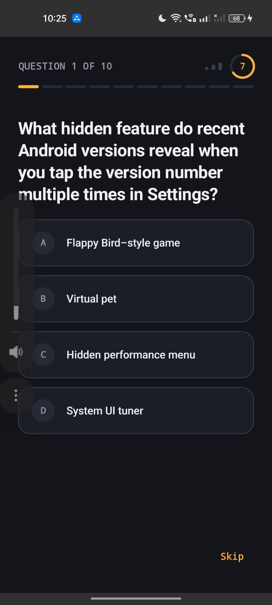
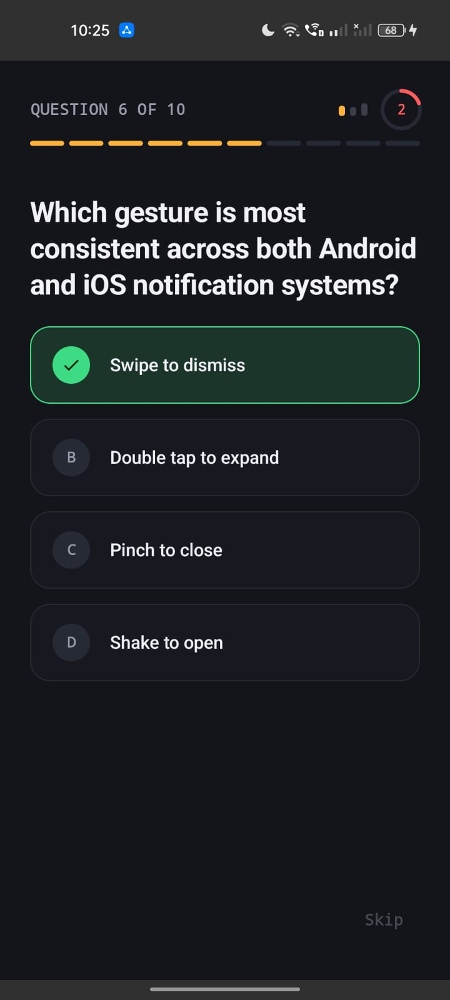
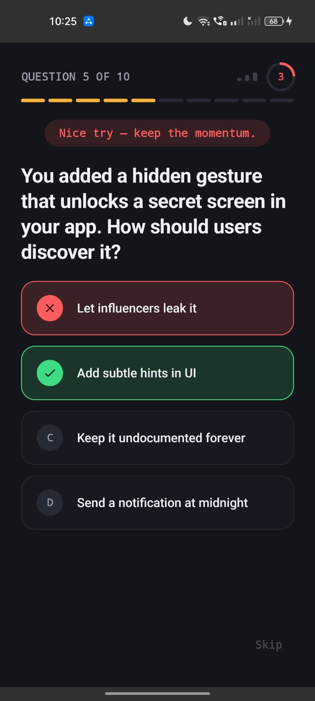
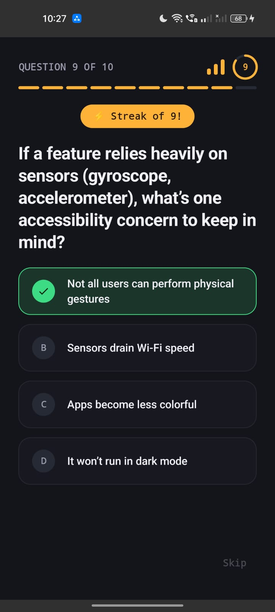
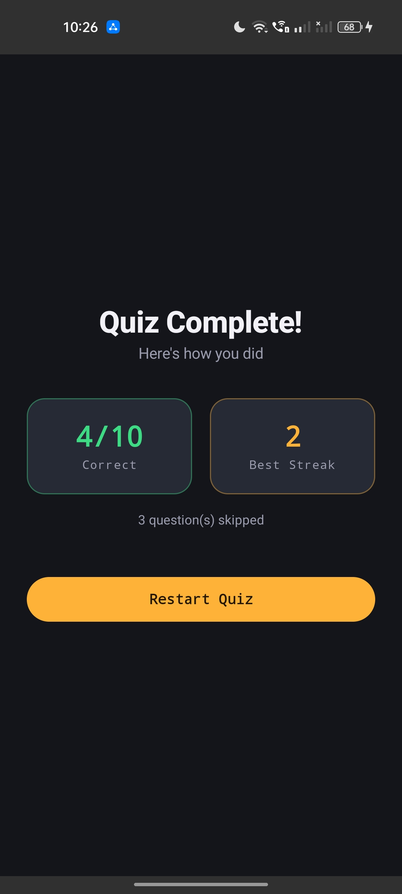
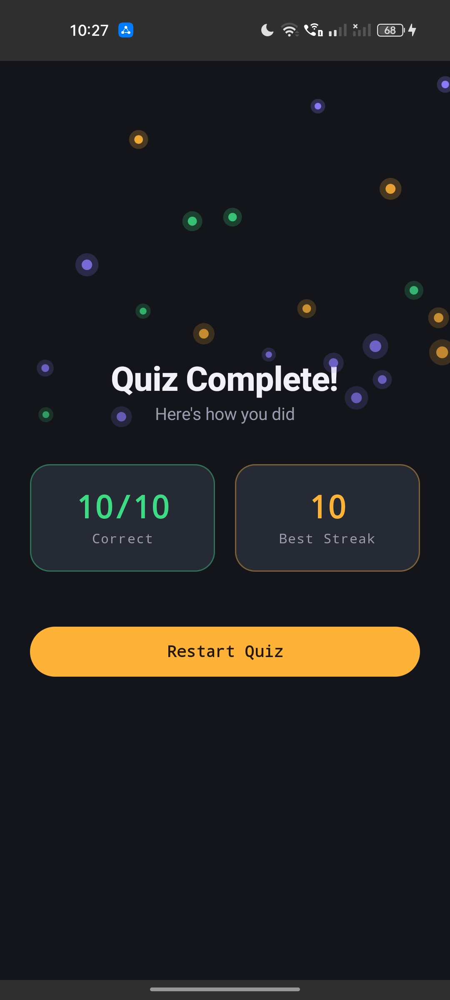

# SparkQuiz

A 10-question Android MCQ quiz app built for the R0 assignment brief — fetches questions from
a hosted JSON source, walks the user through a streak-driven quiz with a 10-second
per-question timer, and ends on a results screen.

## Demo

- **APK:** [https://drive.google.com/file/d/1qe7a-lt21BqyrX1RKILFQV5--jCZikkJ/view?usp=sharing]
- **Video walkthrough:** [https://youtube.com/shorts/JCJY58rZzeg?feature=share]

## Screenshots

| Loading | Question | Correct Answer | Wrong Answer | Streak | Results | Celebration |
|---|---|---|---|---|---|---|
|  |  |  |  |  |  |  |

## Architecture

MVVM with a clean split between data, state, and UI:

```
com.leelasri.sparkquiz/
├── SparkQuizApplication.kt        Hilt entry point
├── MainActivity.kt                Hosts the Compose root, edge-to-edge enabled
│
├── data/
│   ├── model/Question.kt          QuestionDto (API shape) + Question (domain) + mapper
│   ├── remote/
│   │   ├── QuizApiService.kt      Retrofit interface — GETs the questions JSON
│   │   └── NetworkModule.kt       Hilt: OkHttp / Retrofit / ApiService providers
│   ├── repository/
│   │   ├── QuizRepository.kt      interface
│   │   └── QuizRepositoryImpl.kt  fetches + maps DTOs → domain models
│   └── di/RepositoryModule.kt     Hilt @Binds
│
└── ui/
    ├── SparkQuizApp.kt            Root composable — switches screens off QuizUiState
    ├── quiz/
    │   ├── QuizUiState.kt         sealed state: Loading / Error / Question / Results
    │   ├── QuizViewModel.kt       all quiz, streak, and timer logic
    │   └── QuizScreen.kt          question screen UI
    ├── splash/SplashScreen.kt     loading + error/retry
    ├── results/ResultsScreen.kt   final score + standout-result celebration
    ├── components/                reusable UI pieces (option button, streak meter,
    │                               progress ticks, countdown timer, banners, sparkles)
    └── theme/                     Color / Theme / Type — the app's brand system
```

One `QuizViewModel`, created once via `hiltViewModel()` and shared across screens, drives
everything through a single `StateFlow<QuizUiState>`. Screens are a `when` over that sealed
state inside an `AnimatedContent` — no navigation library, since the flow is strictly linear
(Splash → Quiz → Results) and a nav graph would add complexity without benefit at this scope.

## Feature checklist (against the brief)

### Launch & Load
- [x] JSON parsed into `List<Question>` via Retrofit + Gson, mapped through a single
  `toDomain()` function so a schema change only touches one file.
- [x] Splash screen shows a loading indicator while fetching; re-purposed to show an
  error + Retry state on failure (e.g. no network).

### Quiz Flow
- [x] Question screen: question text + 4 lettered (A/B/C/D) options.
- [x] Tapping an option reveals the correct answer (green, animated check + spring
  "pop" + expanding ring burst) and, if wrong, the selected option (red, animated
  close icon + a horizontal shake).
- [x] Auto-advances 2 seconds after reveal.
- [x] "Skip" advances immediately, no reveal.
- [x] **10-second per-question timer**, shown as a depleting ring next to the streak
  meter — auto-skips the question if nobody answers in time (see Extras below).
- [x] **Swipe-left gesture** also skips the current question, in addition to the Skip
  button (see note under Design Choices on the gesture direction).

### Streak Logic
- [x] Consecutive correct answers tracked in the ViewModel.
- [x] At every multiple of 3 (3, 6, 9…) the "SparkMeter" — a small energy-bar visual
  next to the question counter — fills, and a gold celebration banner + haptic
  tick fires.
- [x] Any wrong answer resets the streak to 0.

### End of Quiz
- [x] Results screen after question 10: Correct/Total, longest streak achieved, and
  skipped-question count (only shown if greater than 0).
- [x] "Restart Quiz" resets all counters and returns to Question 1 — reuses the
  already-fetched question list, no re-fetch needed.
- [x] **Bonus:** a one-shot falling-sparkle celebration (custom Canvas particle
  animation) plays on the results screen for a perfect score (10/10) or a streak
  of 9 or higher.

## Extras beyond the brief

- **10-second countdown timer** per question — not in the original spec, added on request.
  A timeout is treated the same as tapping Skip (advances immediately, streak resets,
  counted as skipped).
- **Encouraging message on a wrong answer**, drawn from a rotating pool of six phrases so
  it doesn't feel repetitive over a 10-question quiz.
- **Correct/incorrect micro-interactions** — spring-physics "pop" + expanding ring burst on
  correct, horizontal shake on wrong — built with Compose's native `Animatable`/`spring()`
  APIs rather than an external animation library (Lottie), to avoid pulling in a dependency
  and an unverified asset file.

## Design choices worth flagging

- **Streak celebration fires on every multiple of 3** (3, 6, 9…), not just the first time —
  read as the more "engaging" interpretation for a 10-question quiz where a longer streak
  is possible.
- **Skip and a timer timeout also reset the streak.** The brief specifies this only for a
  wrong answer; not answering in time (or choosing to skip) felt like it shouldn't preserve
  a streak that wasn't earned. Flagging in case a stricter literal reading is preferred —
  it's a one-line change in `QuizViewModel.handleUnanswered()` if so.
- **Swipe direction**: the brief's example gesture was "swipe right to navigate." Implemented
  as swipe-**left**-to-skip instead — with a reveal-based flow (the 2-second auto-advance
  already handles forward progression once answered), a leftward "dismiss" swipe reads more
  naturally than a rightward "navigate forward" gesture that would otherwise compete with
  tapping an option.
- **No dynamic (Material You) color.** A quiz app should look like itself on every device,
  not tint itself to the user's wallpaper — two hand-picked brand color schemes (light/dark)
  are used instead.
- **Two-face typography**: system sans-serif for question/body text, system monospace for
  anything "data" (counters, scores, buttons) — a nod to the fact that the quiz content
  itself is Android-developer trivia, at zero extra font-file cost.
- **Correct-answer color is Android's own brand green** (`#3DDC84`) rather than an arbitrary
  green — a small, deliberate detail tying the palette to the quiz's subject matter.
- **Status/navigation bar icon color explicitly tracks the resolved app theme** (light icons
  on dark, dark icons on light) via `WindowCompat` plus a proper `values-night` theme
  resource, rather than relying on OEM default behavior.

## Tech stack

- Kotlin, Jetpack Compose, Material 3
- Hilt (dependency injection)
- Retrofit + Gson (networking)
- Coroutines + StateFlow (async work and state)
- Room is present in the dependency graph from the starter template but currently unused —
  a natural next step would be caching fetched questions for offline replay.

## Running the project

Standard Android Studio project — open, let Gradle sync, run on a device or emulator with
API 24+. Requires network access on first launch to fetch the questions.